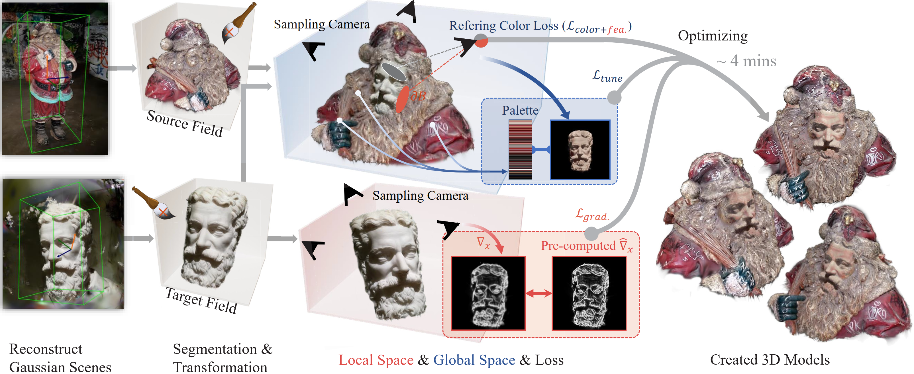

# Towards Realistic Example-based Modeling via 3D Gaussian Stitching

## [Project page](https://ingra14m.github.io/gs_stitching_website) | [Paper](https://arxiv.org/abs/2408.15708)


## Dataset

In our paper, we use:

- synthetic dataset from [NSVF](https://dl.fbaipublicfiles.com/nsvf/dataset/Synthetic_NSVF.zip).
- real-world dataset from [Mip-NeRF 360](https://jonbarron.info/mipnerf360/) and [BlendedMVS](https://github.com/YoYo000/BlendedMVS).


## Pipeline




## Run

The stitching code along with GUI will be released upon acceptance.


## Results

https://github.com/user-attachments/assets/b014f8e9-0952-440b-9fae-269296aedd62

https://github.com/user-attachments/assets/f2e601de-c67a-4c7c-8ac4-c8df98277b31


## BibTex

```shell
@article{gao2024stitching,
  title={Towards Realistic Example-based Modeling via 3D Gaussian Stitching},
  author={Gao, Xinyu and Yang, Ziyi and Gong, Bingchen and Han, Xiaoguang and Yang, Sipeng and Jin, Xiaogang},
  journal={arXiv preprint arXiv:2408.15708},
  year={2024}
```
